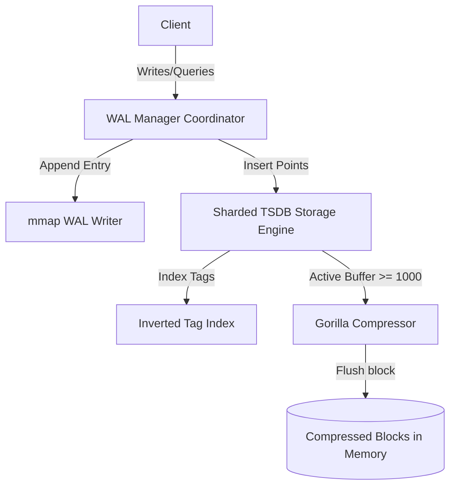

# High-Performance In-Memory Time-Series Database (TSDB)

A lightweight, zero-dependency, ultra-fast in-memory Time-Series Database (TSDB) written in C++17. Designed with mechanical sympathy, thread-safe sharded locking, memory-mapped write-ahead logging (WAL), and Gorilla-style data compression (both delta-of-delta timestamp and XOR floating-point value compression).

---

## Key Features

- **Mechanical Sympathy Core**: Cache-aligned, zero-padding data structures (`DataPoint`) optimized for modern hardware cache lines to prevent false sharing and cache thrashing.
- **Lock-Striped Sharding**: High-concurrency sharding (16 independent shards) protected by `std::shared_mutex` read/write locks, minimizing lock contention during massive parallel write/read workloads.
- **Inverted Tag Indexing**: Fast O(1) tag lookup and O(log N) temporal filtering using a specialized `TagIndex` supporting complex multi-tag queries with Boolean `AND` intersection logic.
- **Memory-Mapped WAL Durability**: High-performance crash durability with zero-copy memory-mapped (`mmap`) append-only logging, atomic offset tracking, and automated threshold-based snapshot compaction.
- **Gorilla Compression Engine**: 
  - **Delta-of-Delta (DoD)** variable-length timestamp compression.
  - **XOR-based** double-precision floating-point value compression.
  - Efficient block-based layouts (`CompressedBlock`) that compress data blocks of 1000 items on-the-fly and selectively decompress only blocks overlapping range queries.

---

## Architecture Overview



---

## Build and Run

### Prerequisites
- CMake (>= 3.14)
- C++17 compatible compiler (GCC, Clang)

### Compilation Steps
Build the database static library, test suite, and high-performance benchmark suite:

```bash
# Configure the build directory
cmake -B build

# Build all targets (tsdb_core, tsdb_tests, tsdb_benchmark)
cmake --build build
```

### Running Tests
Execute the GoogleTest suite to verify database correct state, recovery, tag search, and compression logic:

```bash
cd build
ctest --output-on-failure
```

### Running Benchmarks
Evaluate the database throughput and latency metrics under real-world workloads:

```bash
./build/tsdb_benchmark
```

---

## Performance Benchmark Results

The performance of the database was evaluated under two distinct scenarios:

### 1. Paced Target Concurrency Benchmark (Rate-Limited)
This benchmark measures latency under a stable, paced workload of **10,000 writes/sec** (4 threads) and **1,000 reads/sec** (2 threads). It showcases the performance improvement from the **Day 15 Cache-Line Alignment Optimization** which eliminated false sharing:

| Operation | Target Rate (ops/sec) | Actual Rate (ops/sec) | p50 Latency (µs) | p90 Latency (µs) | p95 Latency (µs) | p99 Latency (µs) |
| :--- | :--- | :--- | :--- | :--- | :--- | :--- |
| **Writes (Pre-Align)** | 10,000 | 9,993.00 | 4.00 | 9.00 | 14.00 | 23.00 |
| **Writes (Post-Align)** | 10,000 | 9,997.00 | 3.00 | 7.00 | 10.00 | **17.00** |
| **Reads** | 1,000 | 999.60 | 4.00 | 7.00 | 9.00 | **15.00** |

> [!NOTE]
> Preventing false sharing on contiguous locks via `alignas(64)` boundaries reduced the rate-limited p99 write latency by **26%** (from 23µs to 17µs).

### 2. Unthrottled Peak Saturation Stress Test (Max Throughput)
This stress test removes all rate limiters, running all concurrent writer and reader threads as fast as possible to find the absolute physical limits of the database engine:

| Metric | Measured Peak Value | p99 Latency (µs) | Description |
| :--- | :--- | :--- | :--- |
| **Max Write Throughput** | **191,000+ writes/sec** | **74.00 µs** | Fully saturated lock-free WAL appending and sharded in-memory index inserts. |
| **Max Read Throughput** | **189,000+ reads/sec** | **33.00 µs** | Parallel shared-lock query executions over Gorilla-compressed historical blocks. |


---

## Gorilla Compression Specs

The integrated Gorilla algorithm achieves substantial memory savings by encoding timestamps and values into dynamic bit streams:

1. **Timestamps (Delta-of-Delta)**:
   - DoD = 0 $\rightarrow$ `0` bit (1 bit total). Excellent for steady-state metric collection intervals.
   - DoD in $[-63, 64]$ $\rightarrow$ `10` prefix + 7 bits.
   - DoD in $[-255, 256]$ $\rightarrow$ `110` prefix + 9 bits.
   - DoD in $[-2047, 2048]$ $\rightarrow$ `1110` prefix + 12 bits.
   - DoD in $[-2147483647, 2147483648]$ $\rightarrow$ `11110` prefix + 32 bits.
   - Fallback $\rightarrow$ `11111` prefix + 64 bits.

2. **Values (XOR Floating Point)**:
   - XOR = 0 $\rightarrow$ `0` bit (1 bit total). Excellent for static value sequences.
   - XOR != 0 $\rightarrow$ `1` prefix:
     - **Window Reuse**: If leading/trailing zeros fall inside the previous window $\rightarrow$ `0` bit + meaningful bits.
     - **New Window**: `1` bit + 5 bits leading zero count + 6 bits meaningful length + meaningful bits.
